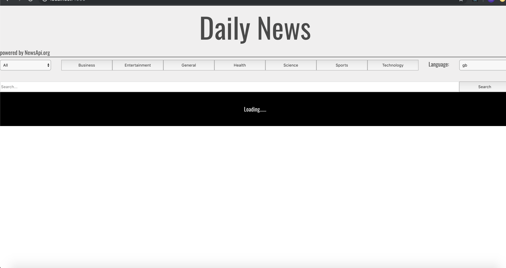
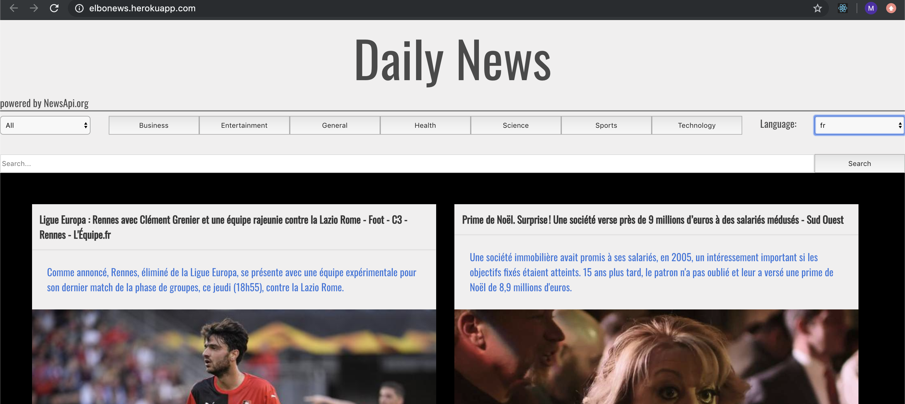
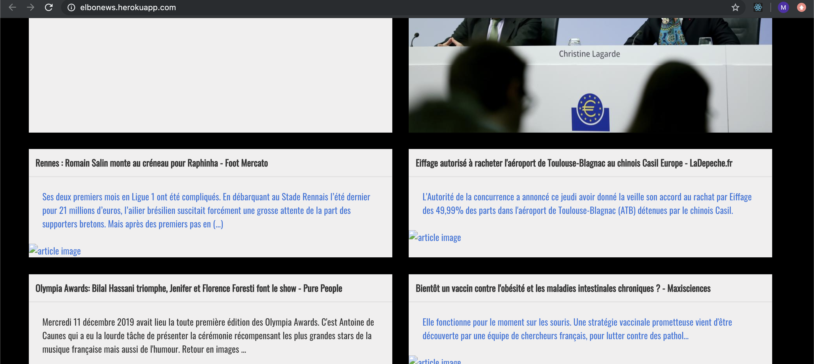
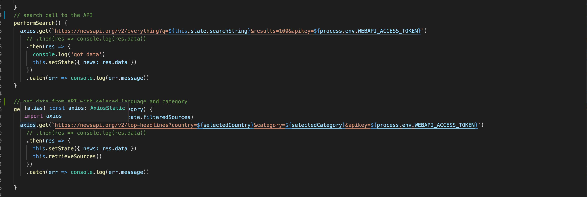

## News App with RESTful API 
Project 2 a 2 day pair programming APP with React and API call is done by axios via React using Node.js and Express. We also decided to use Bulma as the styling platform supported by SCSS to make the site look as we wanted.  

## The process
Pair programming was on one computer using git for backup. Starting with selceting the API we would use. This is a quite overwhelming how may many and for all kinds of purpuse. We agreed on a news API for tech news and started to run though the possibilities. We found NEWSAPI.org gave 500 calls a token and could support several languages.
For the token Json Web Token was used to store the token in a .env file and call it when needed. 

  
## The news APP
Using Insomnia to look at the info comming back from the API we discoved the language was param we wanted to use. The user can select the Langauge and the type of news provided by the API. We found that Bulma did provide a easy to go with card display and we started by mapping all the news we would get from the unpaid version of the API onto the site. 

Then we made a dropdown where language was mapped in to a dropdown list and we were able to make a new call with the data that we have stored in the browser. 

We found the most intuitive was to make the picture clickable but run into the challage that its not always teey provide a picture and made the whole card object clickable instead.
Free word seach field was a opition the API provided so all we had to do to make it work was provide a string and make the axios call to it. 
The style of the app should be like a old fashion newspaper witch set the color and textfont to be black and white. 

## The code
Use of axios in React is asyncronus and becouse the call is a promise the data is not avaliabe at the first render. This was delt with by making loading message when the browser waits for data from the API. We wanted to map in a dropdown list for news in different languages, the problem with this were, we needed to make a call to the API and pick a language it would genrate more call's to the API, so instead we hardcoded the list of languages to make the call faster and put deafult to English as can be seen above.
  
Here is the axios call for the seach function and the news articles. As explained the token is not visible in the code to for security reasons.

## Deployment
For deployment with webpack and React Heroku is a good hosting site. Heroku support Node.js and express with a secure way of keeping the tokens. Setting up the server is made by configuration in the webpack config file and Node.js will run Express.
React need the running enviorment that is installed via the tool yarn build. When the files have been build on the local computer we can just "git push" to Heroku and it start to run. The Heroku server is less forgiven when it comes to running the JavaScript code, one example could be not spelling the port adress with capital letters.   