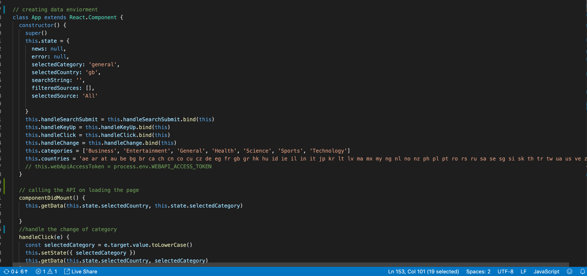

## News App with RESTful API 
Project 2 a 2 day pair programming APP with react and API call using express and axios.

## The process
Pair programming was on one computer using git for backup. The way we approched the task were first finding the API to use. Then we planned how we wanted the site to look and started the project.

## A news APP
We found the news app was the best idea and finding the app where the output were good was the biggest task. We looked at severel API's and found the NEWSAPI.ORG could do what we wanted. This app had a search function and more categories. We wanted the site to have tech news as default.

![axios call] (images/axios.png)

## The code
Use of axios in react is asyncronus and becouse it uses promise the data is not avaliabe at the first render. This was delt with by making loading message when the browser waits for data from the API. We wanted to map in a dropdown list for news in different languages, the difficult with this were if we needed to make a call to the API and pick a language it would genrate more call's to the API, so instead we hardcoded the list of languages to make the call faster. 

## Deployment
Webpack is a great tool to use for render the site on a server. The build is depending of the Heroku sever when we have to use a token for Authorisation. The good implemtation with github makes the deployment less complicated.